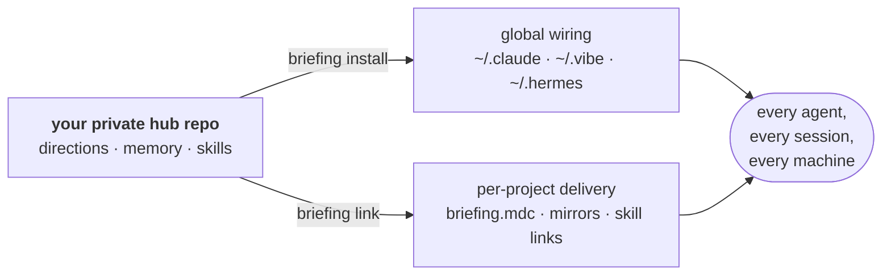

# agent-briefing-template

[](https://github.com/gvazquez87/agent-briefing-template/actions/workflows/ci.yml)
[](https://github.com/gvazquez87/agent-briefing-template/releases)
[](LICENSE)

A personal agent context hub: one **private** repo that carries your always-on
directions, long-form memory, and reusable skills to every machine and every
agent (Claude Code, Cursor, Hermes, Vibe — and anything you write an adapter
for).



This is **not a project rule syncer**. Tools in that category take one set of
project rules and fan them out into every agent's native format; this hub owns
the layer above that — the one that is *yours*. It follows you across machines
and projects, and agents can read and extend what they know about you without
ever rewriting history. Project rules still live in each project's own
`AGENTS.md`; the two layers compose cleanly.

**Key ideas:**

- **Single source of truth.** Rules and memory are edited in exactly one
  place. Everything the agents read is either this repo or generated from it.
- **Generated delivery, never committed.** Each agent gets the directions in
  its native format (symlink, rule file, SOUL.md section). Those artifacts are
  machine-local, ignored in projects via `.git/info/exclude` (managed by
  `briefing link`, nothing to add to a committed `.gitignore`), and
  overwritten on every install.
- **Append-only memory.** Agents may append bullets, never edit or delete.
  A fact is replaced by appending a new bullet marked
  `(supersedes: "<old bullet>")`. The `memory-curator` skill is the one
  sanctioned exception (reviewed as a git diff): it collapses supersede
  pairs, dedupes, and flags rot and contradictions.

## Get started

This is a **template repository**. Don't fork it; forks of public repos can't
be made private, and this repo will hold your personal memory.

1. Click **Use this template** on GitHub and create a **private** repo.
2. Clone it anywhere (the scripts derive every path; `~/.local/agent-briefing`
   is just a nice convention) and install:

   ```bash
   git clone git@github.com:YOU/agent-briefing.git ~/.local/agent-briefing
   ~/.local/agent-briefing/bin/briefing install
   ```

   `install` wires every agent it finds on the machine, and symlinks the
   `briefing` command into `~/.local/bin` so you can run it from anywhere.

3. Make it yours: edit `directions/AGENTS.md` (your always-on rules) and seed
   `memory/preferences.md` and `memory/projects.md`. Already have instructions
   written for other agents? `briefing adopt` gathers well-known files like
   `~/.claude/CLAUDE.md` and `~/.codex/AGENTS.md` (or any file you name) into
   `directions/AGENTS.md` under review markers - fold them in, then commit
   and push.

On every additional machine, repeat step 2. That's the whole deployment.

## Structure

```
directions/AGENTS.md  → always-on universal rules, injected into every agent
memory/               → canonical long-form memory (append-only)
   ├─ preferences.md     → who you are, how you work
   ├─ projects.md        → per-project facts an agent should know cold
   └─ hermes/            → Hermes tier-1 memory, captured via symlinks
skills/               → reusable procedures, one directory per skill
adapters/             → per-agent global wiring, run by `briefing install`
bin/briefing          → the one command: install | adopt | link | unlink | sync | status | path | uninstall
lib/                  → command implementations and shared helpers
test/e2e.sh           → self-contained end-to-end test (throwaway HOME)
```

Every command supports `--help`, and `briefing --dry-run <command>` prints
what would change without changing it.

## How each agent gets the directions

| Agent | Global delivery | Project delivery |
|---|---|---|
| Vibe | `~/.vibe/AGENTS.md` symlink (never stale) | reads project `AGENTS.md` natively |
| Cursor | — | generated `.cursor/rules/briefing.mdc` |
| Hermes | marked section in `~/.hermes/SOUL.md` | `HERMES.md → AGENTS.md` symlink |
| Claude Code | `~/.claude/CLAUDE.md` symlink | `CLAUDE.md → AGENTS.md` symlink (a real committed `CLAUDE.md` is left alone) |

Skills: Hermes, Vibe, and Claude mount all skills globally; per-project
selection (for Vibe, Cursor, and Claude) comes from the project's
`.briefing-skills` manifest.

Both global and project delivery only happen for agents actually present on
the machine. Install an agent later and the next `briefing install` (which
re-links every registered project) creates its artifacts everywhere.

Using another agent? Add one script to `adapters/`; the contract is documented
in [adapters/README.md](adapters/README.md).

## Day to day

- `briefing status` — health check: global wiring per agent, freshness of
  every generated copy (hand-edited copies are called out loudly, since the
  next install overwrites them), per-project links, uncommitted/unpushed
  changes. Exits non-zero if anything needs attention.
- `briefing sync` — commit memory changes, pull --rebase, reinstall (which
  also re-links all registered projects), push. Safe to run any time.
- `briefing link <dir>` — wire a project: links the skills listed in its
  `.briefing-skills` manifest, mirrors `AGENTS.md` to `HERMES.md`, generates
  `.cursor/rules/briefing.mdc`, and registers the project so future installs
  keep it fresh.

## Undoing it all

Everything is reversible, and the repo itself is never touched — your
directions, memory, and skills stay committed there.

- `briefing unlink <dir>` — detach one project: removes the generated files
  and hub-owned skill links, deregisters it. The project's own `AGENTS.md`
  and `.briefing-skills` are untouched.
- `briefing uninstall` — the full inverse of `install`: unlinks every
  registered project, unwires every agent (restoring any `.pre-briefing.bak`
  files, copying Hermes memory back into real files, stripping the generated
  `SOUL.md` section while keeping your identity), and removes the PATH
  symlink and machine-local state. Run `briefing --dry-run uninstall` first
  to see the exact actions. Deleting the clone afterwards is your call;
  `briefing install` puts everything back.

## Adding to a project

Project-specific constraints do **not** live in this repo; they are committed
in each project's own repo. There, commit:

- `AGENTS.md` — the project's constraints (picked up by Vibe and Cursor
  natively, by Hermes via the `HERMES.md` mirror).
- `.briefing-skills` — one shared skill name per line (optional).

Then run `briefing link <project-dir>`. The generated files (skill links,
mirrors, `briefing.mdc`) are machine-local, so `link` ignores them via a
managed block in the project's `.git/info/exclude` - the committed
`.gitignore` stays untouched, and teammates without a briefing hub see
nothing.

## Verifying the wiring

Probe with a fact that exists only in `directions/AGENTS.md`, and forbid
tools so the agent can't read the file at runtime:

```bash
cd <project-dir>
hermes -z "Answer from your standing instructions only - no tools. \
Quote any rule you have about <something unique to your directions>, or say NONE."
```

A verbatim quote proves the directions were injected; "NONE" means that
agent's wiring is broken. The same prompt works in Vibe and Cursor chat.

## Testing

`test/e2e.sh` exercises the full flow (clone, install, adoption, project
linking, pruning, status, repair) in a throwaway HOME with fake agents. It
touches nothing outside a temp directory, so it is safe to run anywhere.
CI runs it on Linux and macOS; the scripts stick to portable shell (bash 3.2,
BSD-compatible sed/awk), so both platforms are first-class.

## Staying current with this template

Your copy is a normal repo. To pull future improvements to the machinery
(`bin/`, `adapters/`), add this template as a second remote and merge a
**release tag** (not `main`):

```bash
git remote add upstream https://github.com/gvazquez87/agent-briefing-template.git
git fetch upstream --tags
git merge v0.3.0   # pick the latest release tag
```

Check [CHANGELOG.md](CHANGELOG.md) for migration notes before merging. Machinery
and content live in disjoint paths, so merges are normally clean.

To hear about new releases, watch this repo on GitHub (Watch → Custom →
Releases) or subscribe to the [releases feed](https://github.com/gvazquez87/agent-briefing-template/releases.atom).

## License

MIT, see [LICENSE](LICENSE).
